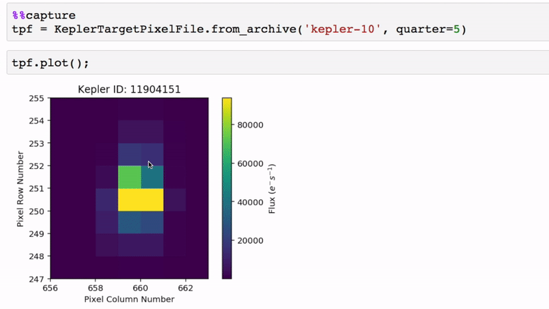

.. title:: Lightkurve docs

.. rst-class:: frontpage

**********
Lightkurve
**********

A friendly Python package for making discoveries with Kepler & TESS.

.. **Version**: |version|

Lightkurve offers a user-friendly way to analyze time series data on the brightness of planets, stars, and galaxies.
The package is focused on supporting science with NASA's Kepler and TESS space telescopes,
but can equally be used to analyze light curves obtained by your backyard telescope.
Lightkurve aims to lower barriers, promote best practices, reduce costs,
and improve scientific fidelity by providing accessible open source
Python :ref:`tools <api>` and :ref:`tutorials <tutorials>`
for time domain astronomy.

Documentation
-------------

.. toctree::
    :maxdepth: 1
    :titlesonly:

    What's new? <whats-new-v2.ipynb>
    quickstart
    tutorials/index
    reference/index
    about/index
