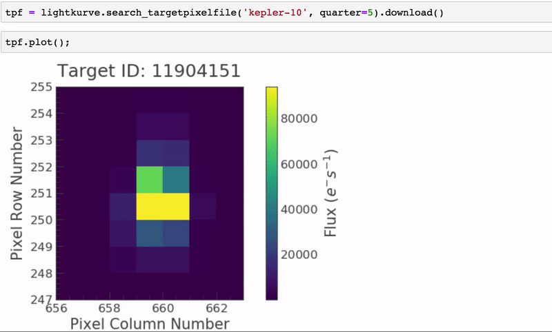

..

======================
Welcome to lightkurve!
======================

The **lightkurve** Python package offers a beautiful and user-friendly way
to analyze astronomical flux time series data,
in particular the pixels and lightcurves obtained by
**NASA's Kepler, K2, and TESS missions**.

This package aims to lower the barrier for both students, astronomers,
and citizen scientists interested in analyzing Kepler and TESS space telescope data.
It does this by providing **high-quality building blocks and tutorials**
which enable both hand-tailored data analyses and advanced automated pipelines.

Lightkurve is an **open source community project** owned by
`the authors <https://github.com/KeplerGO/lightkurve/blob/master/AUTHORS.rst>`_
and supported by
`NASA's Kepler/K2 Guest Observer Office <https://keplerscience.arc.nasa.gov>`_.
The development `takes place on GitHub <https://github.com/KeplerGO/lightkurve>`_
and everyone is :ref:`invited to contribute<contributing>`.

.. _user-docs:

.. toctree::
   :caption: Getting started
   :maxdepth: 1

   tutorials/quickstart.ipynb
   install
   api/index

.. toctree::
    :caption: Tutorials
    :maxdepth: 2

    tutorials/section1.rst
    tutorials/section2.rst
    tutorials/section3.rst

.. toctree::
    :caption: About lightkurve
    :maxdepth: 1

    contributing
    citing
    other_software
